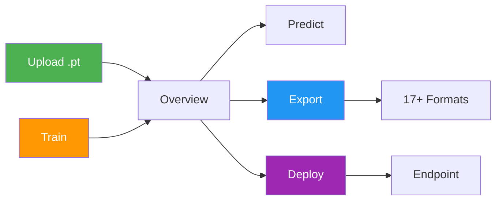
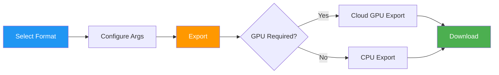

# Models

[Ultralytics Platform](https://platform.ultralytics.com) provides comprehensive model management for training, analyzing, and deploying YOLO models. Upload pretrained models or train new ones directly on the platform.


## Upload Model

Upload existing model weights to the platform:

1. Navigate to your project
2. **Drag and drop** `.pt` files onto the project page or models sidebar
3. Model metadata is parsed automatically from the file

Multiple files can be uploaded simultaneously (up to 3 concurrent).


Supported model formats:

| Format  | Extension | Description               |
| ------- | --------- | ------------------------- |
| PyTorch | `.pt`     | Native Ultralytics format |

After upload, the platform parses model metadata:

- Task type ([detect](../../tasks/detect.md), [segment](../../tasks/segment.md), [pose](../../tasks/pose.md), [OBB](../../tasks/obb.md), [classify](../../tasks/classify.md))
- Architecture (YOLO26n, YOLO26s, etc.)
- Class names and count
- Input size and parameters
- Training results and metrics (if present in checkpoint)

## Train Model

Train a new model directly on the platform:

1. Navigate to your project
2. Click **New Model**
3. Select base model and dataset
4. Configure training parameters
5. Choose cloud or local training
6. Start training

See [Cloud Training](cloud-training.md) for detailed instructions.

## Model Lifecycle



## Model Page Tabs

Each model page has the following tabs:

| Tab          | Content                                       |
| ------------ | --------------------------------------------- |
| **Overview** | Model metadata, key metrics, dataset link     |
| **Train**    | Training charts, console output, system stats |
| **Predict**  | Interactive browser inference                 |
| **Export**   | Format conversion with GPU selection          |
| **Deploy**   | Endpoint creation and management              |

### Overview Tab

Displays model metadata and key metrics:

- Model name (editable), status badge, task type
- Final metrics (mAP50, mAP50-95, precision, recall)
- Metric sparkline charts showing training progression
- Training arguments (epochs, batch size, image size, etc.)
- Dataset link (when trained with a Platform dataset)
- Download button for model weights


### Train Tab

The Train tab has three subtabs:

#### Charts Subtab

Interactive training metric charts showing loss curves and performance metrics over epochs:

| Chart Group       | Metrics                                        |
| ----------------- | ---------------------------------------------- |
| **Metrics**       | mAP50, mAP50-95, precision, recall             |
| **Train Loss**    | train/box_loss, train/cls_loss, train/dfl_loss |
| **Val Loss**      | val/box_loss, val/cls_loss, val/dfl_loss       |
| **Learning Rate** | lr/pg0, lr/pg1, lr/pg2                         |


#### Console Subtab

Live console output from the training process:

- Real-time log streaming during training
- Epoch progress bars and validation results
- Error detection with highlighted error banners
- ANSI color support for formatted output


#### System Subtab

GPU and system metrics during training:

| Metric         | Description                |
| -------------- | -------------------------- |
| **GPU Util**   | GPU utilization percentage |
| **GPU Memory** | GPU memory usage           |
| **GPU Temp**   | GPU temperature            |
| **CPU Usage**  | CPU utilization            |
| **RAM**        | System memory usage        |
| **Disk**       | Disk usage                 |


### Predict Tab

Run interactive inference directly in the browser:

- Upload an image, paste a URL, or use webcam
- Results display with bounding boxes, masks, or keypoints
- Auto-inference when an image is provided
- Supports all task types ([detect](../../tasks/detect.md), [segment](../../tasks/segment.md), [pose](../../tasks/pose.md), [OBB](../../tasks/obb.md), [classify](../../tasks/classify.md))

!!! tip "Quick Testing"

    The Predict tab runs inference on Ultralytics Cloud, so you don't need a local GPU. Results are displayed with interactive overlays matching the model's task type.

### Export Tab

Export your model to 17+ deployment formats. See [Export Model](#export-model) below and the core [Export mode guide](../../modes/export.md) for full details.

### Deploy Tab

Create and manage dedicated inference endpoints. See [Deployments](../deploy/index.md) for details.

## Validation Plots

After training completes, view detailed validation analysis:

### Confusion Matrix

Interactive heatmap showing prediction accuracy per class:


### PR/F1 Curves

Performance curves at different confidence thresholds:


| Curve                    | Description                              |
| ------------------------ | ---------------------------------------- |
| **Precision-Recall**     | Trade-off between precision and recall   |
| **F1-Confidence**        | F1 score at different confidence levels  |
| **Precision-Confidence** | Precision at different confidence levels |
| **Recall-Confidence**    | Recall at different confidence levels    |

## Export Model



Export your model to 17+ deployment formats:

1. Navigate to the **Export** tab
2. Select target format
3. Configure export arguments (image size, half precision, dynamic, etc.)
4. For GPU-required formats (TensorRT), select a GPU type
5. Click **Export**
6. Download when complete


### Supported Formats

The Platform supports export to [17+ deployment formats](../../modes/export.md#export-formats): ONNX, TorchScript, OpenVINO, TensorRT, CoreML, TF SavedModel, TF GraphDef, TF Lite, TF Edge TPU, TF.js, PaddlePaddle, NCNN, MNN, RKNN, IMX500, Axelera, and ExecuTorch.

### Format Selection Guide

| Target             | Recommended Format  | Notes                                                          |
| ------------------ | ------------------- | -------------------------------------------------------------- |
| **NVIDIA GPUs**    | TensorRT            | Maximum inference speed                                        |
| **Intel Hardware** | OpenVINO            | CPUs, GPUs, and VPUs                                           |
| **Apple Devices**  | CoreML              | iOS, macOS, Apple Silicon                                      |
| **Android**        | TF Lite or NCNN     | Best mobile performance                                        |
| **Web Browsers**   | TF.js or ONNX       | ONNX via ONNX Runtime Web                                      |
| **Edge Devices**   | TF Edge TPU or RKNN | Coral and Rockchip (see [supported chips](#rknn-chip-support)) |
| **General**        | ONNX                | Works with most runtimes                                       |


### RKNN Chip Support

When exporting to RKNN format, select your target Rockchip device:

| Chip    | Description          |
| ------- | -------------------- |
| RK3588  | High-end edge SoC    |
| RK3576  | Mid-range edge SoC   |
| RK3568  | Mid-range edge SoC   |
| RK3566  | Mid-range edge SoC   |
| RK3562  | Entry-level edge SoC |
| RV1103  | Vision processor     |
| RV1106  | Vision processor     |
| RV1103B | Vision processor     |
| RV1106B | Vision processor     |
| RK2118  | AI processor         |
| RV1126B | Vision processor     |

### Export Job Lifecycle

Export jobs progress through the following statuses:

| Status        | Description                          |
| ------------- | ------------------------------------ |
| **Queued**    | Export job is waiting to start       |
| **Starting**  | Export job is initializing           |
| **Running**   | Export is in progress                |
| **Completed** | Export finished — download available |
| **Failed**    | Export failed (see error message)    |
| **Cancelled** | Export was cancelled by the user     |

!!! tip "Export Time"

    Export time varies by format. TensorRT exports may take several minutes due to engine optimization. GPU-required formats (TensorRT) run on Ultralytics Cloud GPUs — the default export GPU is RTX 5090.

### Bulk Export Actions

- **Export All**: Click `Export All` to start export jobs for all CPU-based formats with default settings.
- **Delete All Exports**: Click `Delete All` to remove all exports for the model.

### Format Restrictions

Some export formats have architecture or task restrictions:

| Format           | Restriction                                                     |
| ---------------- | --------------------------------------------------------------- |
| **IMX500**       | Only available for YOLOv8 and YOLO11 models                     |
| **Axelera**      | Only available for detection models                             |
| **PaddlePaddle** | Not available for YOLO26 detection/segmentation/pose/OBB models |

## Clone Model

Clone a model to a different project:

1. Open the model page
2. Click the **Clone** button
3. Select the destination project
4. Click **Clone**

The model and its weights are copied to the target project.

## Download Model

Download your model weights:

1. Navigate to the model's **Overview** tab
2. Click the **Download** button
3. The original `.pt` file downloads automatically

Exported formats can be downloaded from the **Export** tab after export completes.

## Dataset Linking

Models can be linked to their source dataset:

- View which dataset was used for training
- Click the dataset card on the Overview tab to navigate to it
- Track data lineage

When training with Platform datasets using the [`ul://` URI format](../data/datasets.md#dataset-uri), linking is automatic.

!!! example "Dataset URI Format"

    ```bash
    # Train with a Platform dataset — linking is automatic
    yolo train model=yolo26n.pt data=ul://username/datasets/my-dataset epochs=100
    ```

    The `ul://` scheme resolves to your Platform dataset. The trained model's Overview tab will show a link back to this dataset (see [Using Platform Datasets](../api/index.md#using-platform-datasets)).

## Visibility Settings

Control who can see your model:

| Setting     | Description                     |
| ----------- | ------------------------------- |
| **Private** | Only you can access             |
| **Public**  | Anyone can view on Explore page |

To change visibility, click the visibility badge (e.g., `private` or `public`) on the model page. Switching to private takes effect immediately. Switching to public shows a confirmation dialog before applying.

## Delete Model

Remove a model you no longer need:

1. Open model actions menu
2. Click **Delete**
3. Confirm deletion

!!! note "Trash and Restore"

    Deleted models go to Trash for 30 days. Restore from [Settings > Trash](../account/trash.md).

## FAQ

### What model architectures are supported?

Ultralytics Platform fully supports all YOLO architectures with dedicated projects:

- [**YOLO26**](../../models/yolo26.md): n, s, m, l, x variants (latest, recommended) — [platform.ultralytics.com/ultralytics/yolo26](https://platform.ultralytics.com/ultralytics/yolo26)
- [**YOLO11**](../../models/yolo11.md): n, s, m, l, x variants — [platform.ultralytics.com/ultralytics/yolo11](https://platform.ultralytics.com/ultralytics/yolo11)
- [**YOLOv8**](../../models/yolov8.md): n, s, m, l, x variants — [platform.ultralytics.com/ultralytics/yolov8](https://platform.ultralytics.com/ultralytics/yolov8)
- [**YOLOv5**](../../models/yolov5.md): n, s, m, l, x variants — [platform.ultralytics.com/ultralytics/yolov5](https://platform.ultralytics.com/ultralytics/yolov5)

All architectures support 5 task types: [detect](../../tasks/detect.md), [segment](../../tasks/segment.md), [pose](../../tasks/pose.md), [OBB](../../tasks/obb.md), and [classify](../../tasks/classify.md).

### Can I download my trained model?

Yes, download your model weights from the model page:

1. Click the download icon on the Overview tab
2. The original `.pt` file downloads automatically
3. Exported formats can be downloaded from the Export tab

### How do I compare models across projects?

Currently, model comparison is within projects. To compare across projects:

1. Clone models to a single project, or
2. Export metrics and compare externally

### What's the maximum model size?

There's no strict limit, but very large models (>2GB) may have longer upload and processing times.

### Can I fine-tune pretrained models?

Yes! You can use any of the official YOLO26 models as a base, or select one of your own completed models from the model selector in the training dialog. The Platform supports fine-tuning from any uploaded checkpoint.
